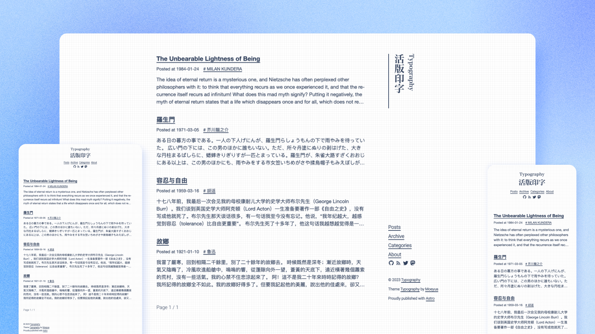

# Typography

<p align='center'>
  
</p>

<h6 align='center'>
<a href="https://astro-theme-typography.vercel.app/">在线演示</a>
</h6>
<h5 align='center'>
<b>本主题重写自 <a href="https://github.com/sumimakito/hexo-theme-typography">hexo-theme-Typography</a></b>
</h5>
<p align='center'>
  <a href="./README.md">English</a> | <b>简体中文</b>
</p>

## 特性

- 基于 **Astro**、**TypeScript**、**UnoCSS（presetWind4）**
- **快速**：优秀的性能表现（页面加载轻量）
- **排版**：遵循中文排版规范，提升阅读体验
- **响应式**：适配手机与桌面端
- **可访问性**：语义化结构与可访问性优化
- **SEO**：Open Graph / Twitter Cards 支持
- **Sitemap** / **RSS** 支持
- **多语言（i18n）**
- 评论系统：Disqus / Giscus / Twikoo
- 深色模式：`auto | light | dark`

## Demo

> 欢迎提交 PR 添加你的站点。

- [在线演示](https://astro-theme-typography.vercel.app/)
- [我的博客](https://blog.moeyua.com/)

## 快速开始

### 本地开发

```bash
pnpm install
pnpm dev
```

### 构建与预览

```bash
pnpm build
pnpm preview
```

## 添加文章

在 `src/contents/posts` 新建 `*.md` / `*.mdx` 文件，并填写 frontmatter（字段约束见 `src/content.config.ts`）：

```md
---
title: 标题
pubDate: 2026-01-23
description: "简介（可选）"
tags: ["tag-a", "tag-b"]
draft: false
pinned: false
slug: my-post-slug
---

正文从这里开始。
```

## 主题配置

主题主要配置集中在 `src/theme.config.ts`。

### 站点信息

```ts
export const themeConfig = defineThemeConfig({
  site: {
    title: '活版印字',
    subtitle: 'Typography',
    description: 'Rediscory the beauty of typography',
    author: 'Moeyua',
    website: 'https://typography.moeyua.com/',
    locale: 'zh-cn',
  },
})
```

### 导航链接

```ts
site: {
  navigationLinks: [
    { title: '文章', url: '/' },
    { title: '归档', url: '/archives' },
    { title: '标签', url: '/tags' },
    { title: '关于', url: '/about' },
  ],
}
```

### 社交链接

`icon` 使用 Iconify class（例如 `i-mdi-github`）：

```ts
site: {
  socialLinks: [
    {
      title: 'github',
      url: 'https://github.com/moeyua/astro-theme-typography',
      icon: 'i-mdi-github',
    },
    {
      title: 'rss',
      url: '/atom.xml',
      icon: 'i-mdi-rss',
    },
  ],
}
```

### 深色模式

```ts
appearance: {
  theme: 'auto', // 'auto' | 'light' | 'dark'
}
```

### 多语言（i18n）

```ts
site: {
  locale: 'zh-cn',
}
```

目前支持：`en-us`、`zh-cn`、`zh-tw`、`ja-jp`、`ko-kr`、`it-it`。
可在 `src/i18n/locales.ts` 中查看/扩展。

### 评论系统

通过 `comment.provider` 选择评论服务，并填写对应配置：

#### Disqus

```ts
comment: {
  provider: 'disqus',
  disqus: {
    shortname: 'your-disqus-shortname',
  },
}
```

#### Giscus

```ts
comment: {
  provider: 'giscus',
  giscus: {
    repo: 'moeyua/astro-theme-typography',
    repoId: 'R_kgDOKy9HOQ',
    category: 'General',
    categoryId: 'DIC_kwDOKy9HOc4CUZP7',
    mapping: 'pathname',
    strict: '1',
    reactionsEnabled: '1',
    emitMetadata: '0',
    inputPosition: 'bottom',
    theme: 'preferred_color_scheme',
    lang: 'zh-CN',
    loading: 'lazy',
  },
}
```

#### Twikoo

```ts
comment: {
  provider: 'twikoo',
  twikoo: {
    envId: 'your-env-id',
  },
}
```

### 统计分析

```ts
analytics: {
  provider: 'umami', // 'google' | 'umami' | 'none'
  umami: {
    websiteId: 'your-umami-website-id',
    scriptUrl: 'https://your-umami-instance/script.js',
  },
}
```

## Pagespeed Score

[](https://pagespeed.web.dev/analysis/https-astro-theme-typography-vercel-app/j34nq9tx0s?form_factor=desktop)
